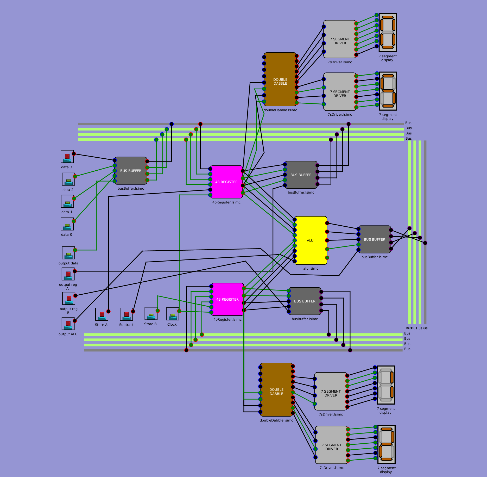
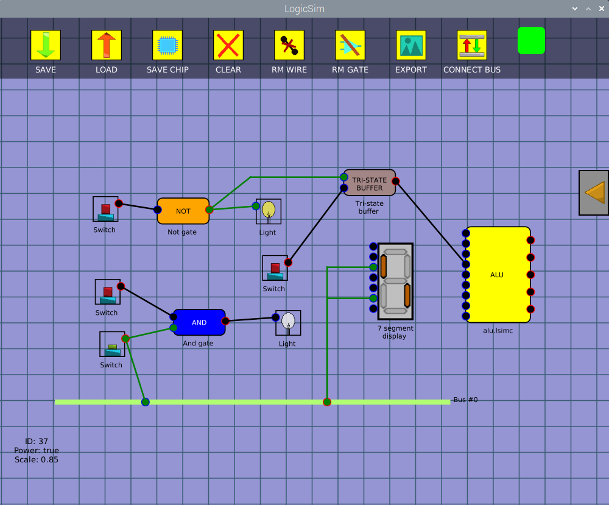
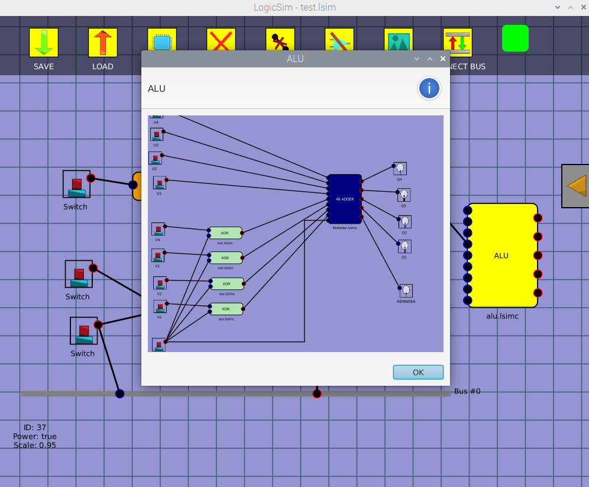

#  LogicSimulator
This is a simple circuit simulator made in Java using the JavaFX framework.

# Features
## Building blocks
* Switches (input)
* Lights (output)
* AND gate
* NOT gate
* Bus
* Tri-state buffer
* 7 Segment display
* Circuits embedding using chips
## Simulator features
* Save/Load projects to a readable JSON format
* Save projects as a chip with your custom name and color
* Clear workspace
* Delete gate/wire
* Connect multiple buses together
* Gate label
* Connect/Disconnect pins from the circuit
* Turn global power on/off
* Export circuit to a PNG image

# Keyboard usage help
* Use `P` to toggle global power on/off
* Use `DELETE` to delete selected gates from the circuit
* Use `Shift` + `DELETE` to delete the wires of the selected gates in the circuit
* Use `Z` and `X` to decrement/increment buses amount when placing a bus
* Use `R` to align selected buses
* Use `F1` to show/hide pin IDs
* Use `Shift` when:
	* placing a wire to align it
	* to place an input pin instead of an output one onto the bus
	* to move pins that are on a bus
* Use `Control` when:
	* placing a wire to delete the previous point
	* to define a new selection without unselecting the previous one
* Use `Alt` to place a wirepoint on the position of the nearest wirepoint on the circuit

# Mouse usage help
* Use the scroll wheel to scale the canvas
* Use `Left click`:
	* on pins to enter wire-placing mode
	* to place the chosen block from the menu on the right
	* to toggle a switch on/off
	* to delete a gate if you clicked on the `RM GATE` button
	* to place a pin on a bus (use `Shift` to toggle between an input/output pin)
	* to resize a bus horizontally or vertically
	* to connect buses together if you clicked on the `CONNECT BUS` button
	* to delete a wire if you clicked on the `RM WIRE` button
	* to move a pin of the bus if the `Shift` key is pressed too
	* to define a selection area or if you click on the background to unselect the current selection
* Use `Right click`:
	* to interrupt an action like creating a bus, deleting a gate or a wire
	* to move the camera
	* to move selected gates or selected wire points
	* to open the gate properties menu where you can change the label, remove a pin (if you clicked on a bus pin), and so on
	* to look inside a chip

# Examples
* [1 bit register](https://github.com/OrangoMango/LogicSimulator/raw/main/examples/1bitRegister.png)
* [4 bit adder](https://github.com/OrangoMango/LogicSimulator/raw/main/examples/4bAdder.png)
* [4 bit register](https://github.com/OrangoMango/LogicSimulator/raw/main/examples/4bRegister.png)
* [7 segment driver](https://github.com/OrangoMango/LogicSimulator/raw/main/examples/7sDriver.png)
* [1 bit adder](https://github.com/OrangoMango/LogicSimulator/raw/main/examples/adder.png)
* [4 bit ALU](https://github.com/OrangoMango/LogicSimulator/raw/main/examples/alu.png)
* [Buffer](https://github.com/OrangoMango/LogicSimulator/raw/main/examples/buffer.png)
* [Bus buffer](https://github.com/OrangoMango/LogicSimulator/raw/main/examples/busBuffer.png)
* [Dabble](https://github.com/OrangoMango/LogicSimulator/raw/main/examples/dabble.png)
* [D Flip-Flop](https://github.com/OrangoMango/LogicSimulator/raw/main/examples/dFlipFlop.png)
* [Double dabble](https://github.com/OrangoMango/LogicSimulator/raw/main/examples/doubleDabble.png)
* [NAND gate](https://github.com/OrangoMango/LogicSimulator/raw/main/examples/nand.png)
* [NOR gate](https://github.com/OrangoMango/LogicSimulator/raw/main/examples/nor.png)
* [OR gate](https://github.com/OrangoMango/LogicSimulator/raw/main/examples/or.png)
* [Set-Reset Flip-Flop](https://github.com/OrangoMango/LogicSimulator/raw/main/examples/srFlipFlop.png)
* [Set-Reset latch](https://github.com/OrangoMango/LogicSimulator/raw/main/examples/srLatch.png)
* [XOR gate](https://github.com/OrangoMango/LogicSimulator/raw/main/examples/xor.png)

# Simulator screenshots and exports
  
  
  

Thanks to @SebLague who inspired me to make this :)